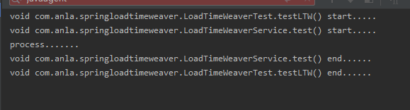
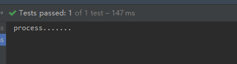

## 介绍
AOP——面向切面编程,通过为目标类织入切面的方式,实现对目标类功能的增强。按切面被织如到目标类中的时间划分,主要有以下几种:
1.运行期织入
这是最常见的,比如在运行期通过为目标类生成动态代理的方式实现AOP就属于运行期织入,
这也是Spring AOP中的默认实现,并且提供了两种创建动态代理的方式:
JDK自带的针对接口的动态代理和使用CGLib动态创建子类的方式创建动态代理。

2.编译期织入
使用特殊的编译器在编译期将切面织入目标类,这种比较少见,因为需要特殊的编译器的支持。

3.类加载期织入
通过字节码编辑技术在类加载期将切面织入目标类中,这是本篇介绍的重点。
它的核心思想是:在目标类的class文件被JVM加载前,
通过自定义类加载器或者类文件转换器将横切逻辑织入到目标类的class文件中,然后将修改后class文件交给JVM加载。这种织入方式可以简称为LTW(LoadTimeWeaving)。

## 结果
运行结果：

方法调用前后分别记录的开始和结束的日志信息,说明我们的切面成功的织入到了目标类。但是这里可能有一个疑问,
这真的是LTW(Load TimeWeaving)通过在类加载期织入切面起到的作用吗？有没有可能是LTW没起作用,
是Spring AOP默认通过运行期生成动态代理的方式实现的AOP。
我们的LogMethodInvokeAspect切面类上并没有加@Component注解向容器注册,
并且配置类CustomLtwConfig上也没有加@EnableAspectJAutoProxy注解开启Aspectj的运行时动态代理,所以这里基于动态代理的AOP并不会生效。

为了验证我们的想法,将aop.xml文件删除

AOP没起到作用,说明刚才的AOP功能确实是通过LTW技术实现的。

当然，如果给切面类加上`@Configuration` ，以及增加全局配置 `@EnableAspectJAutoProxy` 则切面会被加载进Spring 容器中，
而后切面仍然有效。
https://www.cnblogs.com/takumicx/p/10150344.html