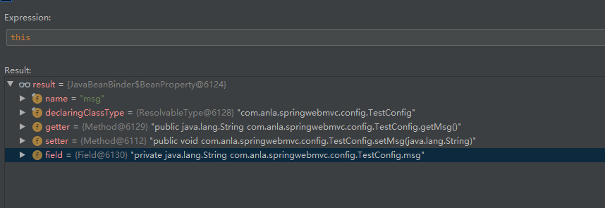
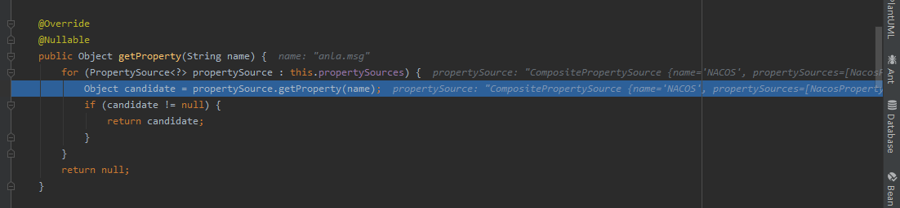

0. 在spring prepare context时，会有注册一个 NacosPropertySourceLocator，里面有个locate方法，将会加载配置：
```
	public PropertySource<?> locate(Environment env) {
		// 获取引用
		ConfigService configService = nacosConfigProperties.configServiceInstance();

		if (null == configService) {
			log.warn("no instance of config service found, can't load config from nacos");
			return null;
		}
		long timeout = nacosConfigProperties.getTimeout();
		nacosPropertySourceBuilder = new NacosPropertySourceBuilder(configService,
				timeout);
		String name = nacosConfigProperties.getName();
		// 获取相关信息
		String dataIdPrefix = nacosConfigProperties.getPrefix();
		if (StringUtils.isEmpty(dataIdPrefix)) {
			dataIdPrefix = name;
		}

		if (StringUtils.isEmpty(dataIdPrefix)) {
			dataIdPrefix = env.getProperty("spring.application.name");
		}
		// 构造PropertySource
		CompositePropertySource composite = new CompositePropertySource(
				NACOS_PROPERTY_SOURCE_NAME);
		// 加载共享配置
		loadSharedConfiguration(composite);
		// 加载外部配置
		loadExtConfiguration(composite);
		// 加载应用数据
		loadApplicationConfiguration(composite, dataIdPrefix, nacosConfigProperties, env);
		// 最终，这里面会包含多个配置项的PropertySource,例如一个spring-webmvc.yml和spring-webmvc-test.yml
		return composite;
	}
```
loadApplicationConfiguration 中，
1. 优先记载本地nacos缓存配置，例如：C:\Users\Admin\nacos\config\fixed-10.8.223.6_8848-e83b4814-6af0-4954-ae99-d8c554f7c593_nacos\data\config-data-tenant\e83b4814-6af0-4954-ae99-d8c554f7c593\DEFAULT_GROUP\spring-webmvc.yml
2. 如果本地，没有尝试使用http接口 /configs 对应获取。
3. 将读取到的配置，构造成一个 NacosPropertySource。并且会缓存到 NacosPropertySourceRepository.NACOS_PROPERTY_SOURCE_REPOSITORY 中。

1. nacos起来时候，会读取到一个spring.cloud.nacos.config数据，而后会获取到一个例如spring-webmvc的配置，而后会尝试去nacos中获取这个配置。也就是这个文件也可以配置在nacos。
而后，会读到所有的active.profiles,而后再去nacos中拿去并缓存到。


2. 最终回到外层的Spring cloud的PropertySourceBootstrapConfiguration中，会将从nacos中获取的CompositePropertySource 保存下来。

3. Spring Boot启动时，nacos会注册一个ApplicationListener：NacosContextRefresher
NacosContextRefresher 会将所有application层级的所有dataIds来监听，如果data发生变化，listener将会刷新配置。
首次运行，会调用：
```
	@Override
	public void onApplicationEvent(ApplicationReadyEvent event) {
		// many Spring context
		if (this.ready.compareAndSet(false, true)) {
			this.registerNacosListenersForApplications();
		}
	}
```


### 数据绑定
数据绑定，spring是通过 一个 ConfigurationPropertiesBindingPostProcessor 来实现。并且只对 `ConfigurationProperties` 注解 类型 进行绑定操作。
1. 可以使用 Validated 注解指定。
2. 委托给 ConfigurationPropertiesBinder.bing 进行具体绑定操作
3. 上一步经过部分验证后，委托给 Binder.bind进行绑定
4. 最终，在Binder.bindBean方法中，会将对应bean拿出来，然后进行设值和绑定操作。
```
	private Object bindBean(ConfigurationPropertyName name, Bindable<?> target, BindHandler handler, Context context,
			boolean allowRecursiveBinding) {
		if (containsNoDescendantOf(context.getSources(), name) || isUnbindableBean(name, target, context)) {
			return null;
		}
		BeanPropertyBinder propertyBinder = (propertyName, propertyTarget) -> bind(name.append(propertyName),
				propertyTarget, handler, context, false);
		Class<?> type = target.getType().resolve(Object.class);
		if (!allowRecursiveBinding && context.hasBoundBean(type)) {
			return null;
		}
		return context.withBean(type, () -> {
			Stream<?> boundBeans = BEAN_BINDERS.stream().map((b) -> b.bind(name, target, context, propertyBinder));
			// 不为空，找到第一个进行绑定操作。
			return boundBeans.filter(Objects::nonNull).findFirst().orElse(null);
		});
	}
```
上面中，最下面的关键方法为 `(b) -> b.bind(name, target, context, propertyBinder)`，此时b为 JavaBeanBinder类型。

所以最终，会进入到JavaBeanBinder的bind方法进行绑定操作：
```
	@Override
	public <T> T bind(ConfigurationPropertyName name, Bindable<T> target, Context context,
			BeanPropertyBinder propertyBinder) {
		boolean hasKnownBindableProperties = hasKnownBindableProperties(name, context);
		Bean<T> bean = Bean.get(target, hasKnownBindableProperties);
		if (bean == null) {
			return null;
		}
		BeanSupplier<T> beanSupplier = bean.getSupplier(target);
		boolean bound = bind(propertyBinder, bean, beanSupplier);
		return (bound ? beanSupplier.get() : null);
	}
```

在进入重载的bind方法
```
	private <T> boolean bind(BeanPropertyBinder propertyBinder, Bean<T> bean, BeanSupplier<T> beanSupplier) {
		boolean bound = false;
		for (BeanProperty beanProperty : bean.getProperties().values()) {
			bound |= bind(beanSupplier, propertyBinder, beanProperty);
		}
		return bound;
	}
```
此时 `bean.getProperties().values()` 里面内容就是一个单独绑定，例如你有生命一个anla.msg，那么 beanProperty 就是msg
再往下进入重载方法:
```
	private <T> boolean bind(BeanSupplier<T> beanSupplier, BeanPropertyBinder propertyBinder, BeanProperty property) {
		String propertyName = property.getName(); // msg
		ResolvableType type = property.getType(); // java.lang.String
		Supplier<Object> value = property.getValue(beanSupplier);
		Annotation[] annotations = property.getAnnotations();
		Object bound = propertyBinder.bindProperty(propertyName,
				Bindable.of(type).withSuppliedValue(value).withAnnotations(annotations));  // 这里就是获取到的值，具体就是从propertySource中获取。
		if (bound == null) {  // 如果值为null，那么就不进行修改。
			return false;
		}
		if (property.isSettable()) {
			property.setValue(beanSupplier, bound);  // 调用反射，复制过程。
		}
		else if (value == null || !bound.equals(value.get())) {
			throw new IllegalStateException("No setter found for property: " + property.getName());
		}
		return true;
	}
```

对于一个JavaBeanBinder，就是如下类型：




## 数据绑定中，值类型获取。
从上面的
```
		Object bound = propertyBinder.bindProperty(propertyName,
				Bindable.of(type).withSuppliedValue(value).withAnnotations(annotations));
```
开始。
bindProperty 则是一个labmda表达式：
```
		BeanPropertyBinder propertyBinder = (propertyName, propertyTarget) -> bind(name.append(propertyName),
				propertyTarget, handler, context, false);
```
所以，最终进入到 Binder的bind方法：
```
	protected final <T> T bind(ConfigurationPropertyName name, Bindable<T> target, BindHandler handler, Context context,
			boolean allowRecursiveBinding) {
		context.clearConfigurationProperty();
		try {
			target = handler.onStart(name, target, context);
			if (target == null) {
				return null;
			}
			Object bound = bindObject(name, target, handler, context, allowRecursiveBinding);
			return handleBindResult(name, target, handler, context, bound);
		}
		catch (Exception ex) {
			return handleBindError(name, target, handler, context, ex);
		}
	}
```
具体获取值类型，在bindObject中：
```
	private <T> Object bindObject(ConfigurationPropertyName name, Bindable<T> target, BindHandler handler,
			Context context, boolean allowRecursiveBinding) {
		ConfigurationProperty property = findProperty(name, context);
		if (property == null && containsNoDescendantOf(context.getSources(), name)) {
			return null;
		}
		AggregateBinder<?> aggregateBinder = getAggregateBinder(target, context);
		if (aggregateBinder != null) {
			return bindAggregate(name, target, handler, context, aggregateBinder);
		}
		if (property != null) {
			try {
				return bindProperty(target, context, property);
			}
			catch (ConverterNotFoundException ex) {
				// We might still be able to bind it as a bean
				Object bean = bindBean(name, target, handler, context, allowRecursiveBinding);
				if (bean != null) {
					return bean;
				}
				throw ex;
			}
		}
		return bindBean(name, target, handler, context, allowRecursiveBinding);
	}
```
最终，在findProperty中获取到了值：
```
	private ConfigurationProperty findProperty(ConfigurationPropertyName name, Context context) {
		if (name.isEmpty()) {
			return null;
		}
		for (ConfigurationPropertySource source : context.getSources()) {
			ConfigurationProperty property = source.getConfigurationProperty(name);
			if (property != null) {
				return property;
			}
		}
		return null;
	}
```

此时 context.getSources() 就是 SpringConfigurationPropertySources，其实一层一层封装下去，还是从 上面的CompositePropertySource 获取值。
看看详细：
接下来进入 `SpringIterableConfigurationPropertySource` 的 getConfigurationProperty方法：
```
	@Override
	public ConfigurationProperty getConfigurationProperty(ConfigurationPropertyName name) {
		ConfigurationProperty configurationProperty = super.getConfigurationProperty(name);
		if (configurationProperty == null) {
			configurationProperty = find(getPropertyMappings(getCache()), name);
		}
		return configurationProperty;
	}
```
super.getConfigurationProperty(name); 也就是进入到SpringConfigurationPropertySource的 getConfigurationProperty 方法
```
	@Override
	public ConfigurationProperty getConfigurationProperty(ConfigurationPropertyName name) {
		PropertyMapping[] mappings = getMapper().map(name);
		return find(mappings, name);
	}
```
实际上，还是调用它的的find方法：
```
	private ConfigurationProperty find(PropertyMapping mapping) {
		String propertySourceName = mapping.getPropertySourceName();
		Object value = getPropertySource().getProperty(propertySourceName);
		if (value == null) {
			return null;
		}
		ConfigurationPropertyName configurationPropertyName = mapping.getConfigurationPropertyName();
		Origin origin = PropertySourceOrigin.get(this.propertySource, propertySourceName);
		return ConfigurationProperty.of(configurationPropertyName, value, origin);
	}
```

再进入到里面 `Object value = getPropertySource().getProperty(propertySourceName);`
```
	@Override
	@Nullable
	public Object getProperty(String name) {
		for (PropertySource<?> propertySource : this.propertySources) {
			Object candidate = propertySource.getProperty(name);
			if (candidate != null) {
				return candidate;
			}
		}
		return null;
	}
```
而此时 propertySource 就是我们在nacos中存储的CompositePropertySource了。




### nacos事件构建
Spring Boot启动时，nacos会注册一个ApplicationListener：NacosContextRefresher
NacosContextRefresher 会将所有application层级的所有dataIds来监听，如果data发生变化，listener将会刷新配置。
首次运行，会调用：
```
	@Override
	public void onApplicationEvent(ApplicationReadyEvent event) {
		// many Spring context
		if (this.ready.compareAndSet(false, true)) {
			this.registerNacosListenersForApplications();
		}
	}
```

进入 NacosContextRefresher的 registerNacosListenersForApplications 中：
```
	private void registerNacosListenersForApplications() {
		if (refreshProperties.isEnabled()) {
			for (NacosPropertySource nacosPropertySource : NacosPropertySourceRepository
					.getAll()) {   // NacosPropertySourceRepository.getAll() 会缓存dateId，也就是 spring-webmvc.yml 和 spring-webmvc-test.yml

				if (!nacosPropertySource.isRefreshable()) {
					continue;
				}

				String dataId = nacosPropertySource.getDataId();   // dataId 就是spring-webmvc.yml 和 spring-webmvc-test.yml
				registerNacosListener(nacosPropertySource.getGroup(), dataId);
			}
		}
	}
```
再看：registerNacosListener
```
	private void registerNacosListener(final String group, final String dataId) {

		Listener listener = listenerMap.computeIfAbsent(dataId, i -> new Listener() {
			@Override
			public void receiveConfigInfo(String configInfo) {
				refreshCountIncrement();
				String md5 = "";
				if (!StringUtils.isEmpty(configInfo)) {
					try {
						MessageDigest md = MessageDigest.getInstance("MD5");
						md5 = new BigInteger(1, md.digest(configInfo.getBytes("UTF-8")))
								.toString(16);
					}
					catch (NoSuchAlgorithmException | UnsupportedEncodingException e) {
						log.warn("[Nacos] unable to get md5 for dataId: " + dataId, e);
					}
				}
				refreshHistory.add(dataId, md5);
				applicationContext.publishEvent(
						new RefreshEvent(this, null, "Refresh Nacos config"));
				if (log.isDebugEnabled()) {
					log.debug("Refresh Nacos config group " + group + ",dataId" + dataId);
				}
			}

			@Override
			public Executor getExecutor() {
				return null;
			}
		});

		try {
			configService.addListener(dataId, group, listener);
		}
		catch (NacosException e) {
			e.printStackTrace();
		}
	}
```
registerNacosListener 往全局变量 listenerMap 加入dataId，以及对应的回调方法，即一旦receiveConfigInfo被调用，就会调用 
```
				applicationContext.publishEvent(
						new RefreshEvent(this, null, "Refresh Nacos config"));
```
进行全局数据刷新。
Nacos 中 Listener 为：
```
public interface Listener {

    /**
     * Get executor for execute this receive
     *
     * @return Executor
     */
    Executor getExecutor();

    /**
     * Receive config info
     *
     * @param configInfo config info
     */
    void receiveConfigInfo(final String configInfo);
}
```
RefreshEvent 是spring cloud的 类型事件，一旦触发，就会调用 RefreshEndpoint.refresh()。


构造完 Listener之后，就会将它加入到 ConfigService 中。
而最终，是加入到了ClientWorker 中。
```
    @Override
    public void addListener(String dataId, String group, Listener listener) throws NacosException {
        worker.addTenantListeners(dataId, group, Arrays.asList(listener));
    }
```
看看ClientWorker里面这个方法：
```
    public void addTenantListeners(String dataId, String group, List<? extends Listener> listeners) throws NacosException {
        group = null2defaultGroup(group);
        String tenant = agent.getTenant();
		// 往cacheMap中加入一个，所以 下面checkConfigInfo 会有一个线程在跑。
        CacheData cache = addCacheDataIfAbsent(dataId, group, tenant);
        for (Listener listener : listeners) {
            cache.addListener(listener);
        }
    }
```


### nacos事件通知

Listener之后 会被加入到 是加入到了ClientWorker，当然事件通知会围绕是加入到了ClientWorker进行。


ClientWorker 在 NacosConfigService中，伴随着 NacosConfigService 创建而创建，看其构造方法：

```
    public ClientWorker(final HttpAgent agent, final ConfigFilterChainManager configFilterChainManager, final Properties properties) {
	// 用于请求http
        this.agent = agent;
        this.configFilterChainManager = configFilterChainManager;

        // Initialize the timeout parameter

        init(properties);
		// 一个定时线程池，专门用于检测执行 checkConfigInfo，其实没什么用
        executor = Executors.newScheduledThreadPool(1, new ThreadFactory() {
            @Override
            public Thread newThread(Runnable r) {
                Thread t = new Thread(r);
                t.setName("com.alibaba.nacos.client.Worker." + agent.getName());
                t.setDaemon(true);
                return t;
            }
        });
		// 另一个定时线程池， 用于执行 LongPollingRunnable 任务，循环往复执行自己，一次超时时间30s
        executorService = Executors.newScheduledThreadPool(Runtime.getRuntime().availableProcessors(), new ThreadFactory() {
            @Override
            public Thread newThread(Runnable r) {
                Thread t = new Thread(r);
                t.setName("com.alibaba.nacos.client.Worker.longPolling." + agent.getName());
                t.setDaemon(true);
                return t;
            }
        });
		
		// 每10毫秒执行一次。
        executor.scheduleWithFixedDelay(new Runnable() {
            @Override
            public void run() {
                try {
                    checkConfigInfo();
                } catch (Throwable e) {
                    LOGGER.error("[" + agent.getName() + "] [sub-check] rotate check error", e);
                }
            }
        }, 1L, 10L, TimeUnit.MILLISECONDS);
    }
```
上面定义了两个线程池：executor 和 executorService。

executor 中执行任务是 executorService 执行任务的入口。
进入构造方法后，executor 中首先被放入任务，执行方法是 checkConfigInfo，10ms触发一次。
```
    public void checkConfigInfo() {
        // 分任务
        int listenerSize = cacheMap.get().size();
        // 向上取整为批数
        int longingTaskCount = (int) Math.ceil(listenerSize / ParamUtil.getPerTaskConfigSize());
        if (longingTaskCount > currentLongingTaskCount) {
            for (int i = (int) currentLongingTaskCount; i < longingTaskCount; i++) {
                // 要判断任务是否在执行 这块需要好好想想。 任务列表现在是无序的。变化过程可能有问题
                executorService.execute(new LongPollingRunnable(i));
            }
            currentLongingTaskCount = longingTaskCount;
        }
    }
```
但是是10ms触发一次，其实感觉这里不用10ms触发一次，浪费。
ParamUtil.getPerTaskConfigSize() 是每次线程中，获取配置最大大小，默认为3000，及一个线程，可以一次性监听3000个配置变更。
currentLongingTaskCount： 代表当前执行的 LongPollingRunnable 任务个数。
如果发现有配置更新，那么会新建一个 LongPollingRunnable 放入 executorService 中，但是这个线程池并没有设置定时！。

直接看 LongPollingRunnable run方法：
```
        @Override
        public void run() {

            List<CacheData> cacheDatas = new ArrayList<CacheData>();
            List<String> inInitializingCacheList = new ArrayList<String>();
            try {
                // check failover config
				// 检查容错配置，即检查本地文件信息
				// 对每个配置执行 checkLocalConfig 方法，用于监听其变更。
                for (CacheData cacheData : cacheMap.get().values()) {
                    if (cacheData.getTaskId() == taskId) {
					// 只会检查当前task的任务。
                        cacheDatas.add(cacheData);
                        try {
                            checkLocalConfig(cacheData);
                            if (cacheData.isUseLocalConfigInfo()) {
                                cacheData.checkListenerMd5();
                            }
                        } catch (Exception e) {
                            LOGGER.error("get local config info error", e);
                        }
                    }
                }

                // 检查服务器文件信息
                List<String> changedGroupKeys = checkUpdateDataIds(cacheDatas, inInitializingCacheList);

                for (String groupKey : changedGroupKeys) {
                    String[] key = GroupKey.parseKey(groupKey);
                    String dataId = key[0];
                    String group = key[1];
                    String tenant = null;
                    if (key.length == 3) {
                        tenant = key[2];
                    }
                    try {
                        String content = getServerConfig(dataId, group, tenant, 3000L);
                        CacheData cache = cacheMap.get().get(GroupKey.getKeyTenant(dataId, group, tenant));
                        cache.setContent(content);
                        LOGGER.info("[{}] [data-received] dataId={}, group={}, tenant={}, md5={}, content={}",
                            agent.getName(), dataId, group, tenant, cache.getMd5(),
                            ContentUtils.truncateContent(content));
                    } catch (NacosException ioe) {
                        String message = String.format(
                            "[%s] [get-update] get changed config exception. dataId=%s, group=%s, tenant=%s",
                            agent.getName(), dataId, group, tenant);
                        LOGGER.error(message, ioe);
                    }
                }
                for (CacheData cacheData : cacheDatas) {
                    if (!cacheData.isInitializing() || inInitializingCacheList
                        .contains(GroupKey.getKeyTenant(cacheData.dataId, cacheData.group, cacheData.tenant))) {
                        cacheData.checkListenerMd5();
                        cacheData.setInitializing(false);
                    }
                }
                inInitializingCacheList.clear();

                executorService.execute(this);

            } catch (Throwable e) {

                // If the rotation training task is abnormal, the next execution time of the task will be punished
                LOGGER.error("longPolling error : ", e);
                executorService.schedule(this, taskPenaltyTime, TimeUnit.MILLISECONDS);
            }
        }
```

checkLocalConfig 主要为更新本地文件信息，过程逻辑为：
获取本地缓存的文件，以及配置中是否使用缓存去进行判断。
1. 当不使用本地文件信息，并且本地文件存在。那么重新设置 相关只 到 cacheData 中。
2. 如果有用到本地文件信息，但是本地文件不存在，那么将 cacheData 设置为没有用到本地文件信息（isUseLocalConfig）。
3. 如果isUseLocalConfig=true，且有文件，且有变更，那么更新文件（通过判断cacheData最后更新时间来判断）。

checkUpdateDataIds 为阻塞式获取服务器文件更新信息，过程逻辑包括：
1. 为每一个 CacheData拼装url。例如拼装后的为：spring-webmvc-test.ymlDEFAULT_GROUP82bb792f6615a0fd7fcb8a1e4b1437f3e83b4814-6af0-4954-ae99-d8c554f7c593spring-webmvc.ymlDEFAULT_GROUPe83b4814-6af0-4954-ae99-d8c554f7c593
2. 判断是否为第一个cacheData
3. 将1和2得到参数，调用 checkUpdateConfigStr
```
    List<String> checkUpdateConfigStr(String probeUpdateString, boolean isInitializingCacheList) throws IOException {

        List<String> params = Arrays.asList(Constants.PROBE_MODIFY_REQUEST, probeUpdateString);
		// 设置请求头
        List<String> headers = new ArrayList<String>(2);
        headers.add("Long-Pulling-Timeout");
        headers.add("" + timeout);

        // told server do not hang me up if new initializing cacheData added in
        if (isInitializingCacheList) {
            headers.add("Long-Pulling-Timeout-No-Hangup");
            headers.add("true");
        }

        if (StringUtils.isBlank(probeUpdateString)) {
            return Collections.emptyList();
        }

        try {
		// 阻塞式调用，timeout为30s
            HttpResult result = agent.httpPost(Constants.CONFIG_CONTROLLER_PATH + "/listener", headers, params,
                agent.getEncode(), timeout);

            if (HttpURLConnection.HTTP_OK == result.code) {
                setHealthServer(true);
                return parseUpdateDataIdResponse(result.content);
            } else {
                setHealthServer(false);
                LOGGER.error("[{}] [check-update] get changed dataId error, code: {}", agent.getName(), result.code);
            }
        } catch (IOException e) {
            setHealthServer(false);
            LOGGER.error("[" + agent.getName() + "] [check-update] get changed dataId exception", e);
            throw e;
        }
        return Collections.emptyList();
    }
```
上面逻辑就是条用http接口请求：
1. 拼装headers
2. 请求，返回请求结果
3. 默认为阻塞30s调用。如果服务端更改了，则会立即返回。
其中调用listener为：/v1/cs/configs/listener，在param中会将对应dataId和namespace传入。

回到刚刚LongPollingRunnable 的run方法。
当获取 changedGroupKeys 返回之后，会对返回的key进行判断。
```
                for (String groupKey : changedGroupKeys) {
                    String[] key = GroupKey.parseKey(groupKey);
                    String dataId = key[0];
                    String group = key[1];
                    String tenant = null;
                    if (key.length == 3) {
                        tenant = key[2];
                    }
                    try {
                        String content = getServerConfig(dataId, group, tenant, 3000L);
                        CacheData cache = cacheMap.get().get(GroupKey.getKeyTenant(dataId, group, tenant));
                        cache.setContent(content);
                        LOGGER.info("[{}] [data-received] dataId={}, group={}, tenant={}, md5={}, content={}",
                            agent.getName(), dataId, group, tenant, cache.getMd5(),
                            ContentUtils.truncateContent(content));
                    } catch (NacosException ioe) {
                        String message = String.format(
                            "[%s] [get-update] get changed config exception. dataId=%s, group=%s, tenant=%s",
                            agent.getName(), dataId, group, tenant);
                        LOGGER.error(message, ioe);
                    }
                }
                for (CacheData cacheData : cacheDatas) {
					// 对所有的CacheData进行校验，
                    if (!cacheData.isInitializing() || inInitializingCacheList
                        .contains(GroupKey.getKeyTenant(cacheData.dataId, cacheData.group, cacheData.tenant))) {
                        cacheData.checkListenerMd5();
                        cacheData.setInitializing(false);
                    }
                }
                inInitializingCacheList.clear();

                executorService.execute(this);

```
1. 有返回说明有变更。
2. 变更就会调用`getServerConfig(dataId, group, tenant, 3000L)` 去全量获取这个dataId和namespace下面所有内容。
3. 并且会将 content设置进CacheData中。
4. 会再进入一个循环，对所有CacheData进行类型校验，如果不在初始化，或者 inInitializingCacheList 中包含该CacheData（说明这个CacheData 正是当前线程池中监听的CacheData），那么就检查其md5.

```
    void checkListenerMd5() {
        for (ManagerListenerWrap wrap : listeners) {
            if (!md5.equals(wrap.lastCallMd5)) {
                safeNotifyListener(dataId, group, content, md5, wrap);
            }
        }
    }
```
md5就是content的md5，在CacheData设置content时候，就会设置md5.
也就是拿到 当前 CacheData 所包含的所有 Listener，如果当前 CacheData的md5发生变化，那么就调用 safeNotifyListener 进行变更。
```
    private void safeNotifyListener(final String dataId, final String group, final String content,
                                    final String md5, final ManagerListenerWrap listenerWrap) {
        final Listener listener = listenerWrap.listener;

        Runnable job = new Runnable() {
            @Override
            public void run() {
			// 获取classloader
                ClassLoader myClassLoader = Thread.currentThread().getContextClassLoader();
                ClassLoader appClassLoader = listener.getClass().getClassLoader();
                try {
                    if (listener instanceof AbstractSharedListener) {
                        AbstractSharedListener adapter = (AbstractSharedListener) listener;
                        adapter.fillContext(dataId, group);
                        LOGGER.info("[{}] [notify-context] dataId={}, group={}, md5={}", name, dataId, group, md5);
                    }
                    // 执行回调之前先将线程classloader设置为具体webapp的classloader，以免回调方法中调用spi接口是出现异常或错用（多应用部署才会有该问题）。
                    Thread.currentThread().setContextClassLoader(appClassLoader);

                    ConfigResponse cr = new ConfigResponse();
                    cr.setDataId(dataId);
                    cr.setGroup(group);
                    cr.setContent(content);
					// 若有拦截其，执行filter拦截其
                    configFilterChainManager.doFilter(null, cr);
                    String contentTmp = cr.getContent();
					// 拿到所有的content，执行Listener的回调。
                    listener.receiveConfigInfo(contentTmp);
					// 设置 lastCallMd5 为当前md5
                    listenerWrap.lastCallMd5 = md5;
                    LOGGER.info("[{}] [notify-ok] dataId={}, group={}, md5={}, listener={} ", name, dataId, group, md5,
                        listener);
                } catch (NacosException de) {
                    LOGGER.error("[{}] [notify-error] dataId={}, group={}, md5={}, listener={} errCode={} errMsg={}", name,
                        dataId, group, md5, listener, de.getErrCode(), de.getErrMsg());
                } catch (Throwable t) {
                    LOGGER.error("[{}] [notify-error] dataId={}, group={}, md5={}, listener={} tx={}", name, dataId, group,
                        md5, listener, t.getCause());
                } finally {
                    Thread.currentThread().setContextClassLoader(myClassLoader);
                }
            }
        };

        final long startNotify = System.currentTimeMillis();
        try {
            if (null != listener.getExecutor()) {
                listener.getExecutor().execute(job);
            } else {
                job.run();
            }
        } catch (Throwable t) {
            LOGGER.error("[{}] [notify-error] dataId={}, group={}, md5={}, listener={} throwable={}", name, dataId, group,
                md5, listener, t.getCause());
        }
        final long finishNotify = System.currentTimeMillis();
        LOGGER.info("[{}] [notify-listener] time cost={}ms in ClientWorker, dataId={}, group={}, md5={}, listener={} ",
            name, (finishNotify - startNotify), dataId, group, md5, listener);
    }
```


### 对Spring cloud的刷新回调
先看看 Listener的回调：
```
			public void receiveConfigInfo(String configInfo) {
			// 回调计数
				refreshCountIncrement();
				String md5 = "";
				if (!StringUtils.isEmpty(configInfo)) {
					try {
					// 获取一份当前md5加密
						MessageDigest md = MessageDigest.getInstance("MD5");
						md5 = new BigInteger(1, md.digest(configInfo.getBytes("UTF-8")))
								.toString(16);
					}
					catch (NoSuchAlgorithmException | UnsupportedEncodingException e) {
						log.warn("[Nacos] unable to get md5 for dataId: " + dataId, e);
					}
				}
				// 将当前md5加密放入dataId中，记录历史。
				refreshHistory.add(dataId, md5);
				// 调用Spring事件。RefreshEvent 类型
				applicationContext.publishEvent(
						new RefreshEvent(this, null, "Refresh Nacos config"));
				if (log.isDebugEnabled()) {
					log.debug("Refresh Nacos config group " + group + ",dataId" + dataId);
				}
			}
```

再看 ：
```
	protected void publishEvent(Object event, @Nullable ResolvableType eventType) {
		Assert.notNull(event, "Event must not be null");

		// Decorate event as an ApplicationEvent if necessary
		ApplicationEvent applicationEvent;
		if (event instanceof ApplicationEvent) {
		// 转化类型
			applicationEvent = (ApplicationEvent) event;
		}
		else {
			applicationEvent = new PayloadApplicationEvent<>(this, event);
			if (eventType == null) {
				eventType = ((PayloadApplicationEvent<?>) applicationEvent).getResolvableType();
			}
		}

		// Multicast right now if possible - or lazily once the multicaster is initialized
		if (this.earlyApplicationEvents != null) {
			this.earlyApplicationEvents.add(applicationEvent);
		}
		else {
		// 获取所有listener，进行广播
			getApplicationEventMulticaster().multicastEvent(applicationEvent, eventType);
		}
		// 告诉父容器
		// Publish event via parent context as well...
		if (this.parent != null) {
			if (this.parent instanceof AbstractApplicationContext) {
				((AbstractApplicationContext) this.parent).publishEvent(event, eventType);
			}
			else {
				this.parent.publishEvent(event);
			}
		}
	}
```
此时 getApplicationEventMulticaster 获取到的是一个SimpleApplicationEventMulticaster。看其 multicastEvent 方法：
```
	public void multicastEvent(final ApplicationEvent event, @Nullable ResolvableType eventType) {
	// 获取一个 ResolvableType 类型，实际上为 RefreshEvent类型
		ResolvableType type = (eventType != null ? eventType : resolveDefaultEventType(event));
		// 获取一个线程池
		Executor executor = getTaskExecutor();
		for (ApplicationListener<?> listener : getApplicationListeners(event, type)) {
		// 对所有感兴趣的listener进行广播。
			if (executor != null) {
				executor.execute(() -> invokeListener(listener, event));
			}
			else {
				invokeListener(listener, event);
			}
		}
	}
```
对所有感兴趣的listener进行广播。 其中就包括 `RestartApplicationListener`、`DelegatingApplicationListener`、`RefreshEventListener`。
其中，RestartApplicationListener 不感兴趣。
DelegatingApplicationListener 也不感兴趣。

但是 `RefreshEventListener` 感兴趣：
```
	@Override
	public void onApplicationEvent(ApplicationEvent event) {
		if (event instanceof ApplicationReadyEvent) {
			handle((ApplicationReadyEvent) event);
		}
		else if (event instanceof RefreshEvent) {
			handle((RefreshEvent) event);
		}
	}
```
看其handle方法：
```
	public void handle(RefreshEvent event) {
		if (this.ready.get()) { // don't handle events before app is ready
			log.debug("Event received " + event.getEventDesc());
			Set<String> keys = this.refresh.refresh();
			log.info("Refresh keys changed: " + keys);
		}
	}
```
refresh 为： ContextRefresher.看其refresh方法：
```
	public synchronized Set<String> refresh() {
		Set<String> keys = refreshEnvironment();
		this.scope.refreshAll();
		return keys;
	}
```
看其 refreshEnvironment 方法：
```
	public synchronized Set<String> refreshEnvironment() {
	// 找到现有的所有的变量配置
		Map<String, Object> before = extract(
				this.context.getEnvironment().getPropertySources());
		addConfigFilesToEnvironment();
		Set<String> keys = changes(before,
				extract(this.context.getEnvironment().getPropertySources())).keySet();
		this.context.publishEvent(new EnvironmentChangeEvent(this.context, keys));
		return keys;
	}
```

后面的就看这里吧：https://blog.csdn.net/cml_blog/article/details/78411312


第四步的：this.context.publishEvent(new EnvironmentChangeEvent(this.context, keys));
操作，会有四个Listener： RestartApplicationListener, DelegatingApplicationListener, LoggingRebinder, ConfigurationPropertiesRebinder.
LoggingRebinder 只是加载日志。
最终绑定操作在 `ConfigurationPropertiesRebinder` 中进行。

```
	@ManagedOperation
	public void rebind() {
		this.errors.clear();
		for (String name : this.beans.getBeanNames()) {
			rebind(name);
		}
	}
```
对所有的refresh 的scope的bean，进行销毁并重新绑定。
```
	@ManagedOperation
	public boolean rebind(String name) {
		if (!this.beans.getBeanNames().contains(name)) {
			return false;
		}
		if (this.applicationContext != null) {
			try {
				Object bean = this.applicationContext.getBean(name);
				if (AopUtils.isAopProxy(bean)) {
					bean = ProxyUtils.getTargetObject(bean);
				}
				if (bean != null) {
					// 对该bean进行销毁。
					this.applicationContext.getAutowireCapableBeanFactory()
							.destroyBean(bean);
					// 对该bean进行初始化。
					this.applicationContext.getAutowireCapableBeanFactory()
							.initializeBean(bean, name);
					return true;
				}
			}
			catch (RuntimeException e) {
				this.errors.put(name, e);
				throw e;
			}
			catch (Exception e) {
				this.errors.put(name, e);
				throw new IllegalStateException("Cannot rebind to " + name, e);
			}
		}
		return false;
	}
```


