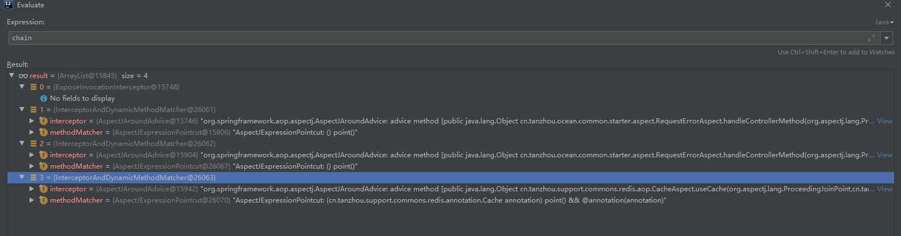
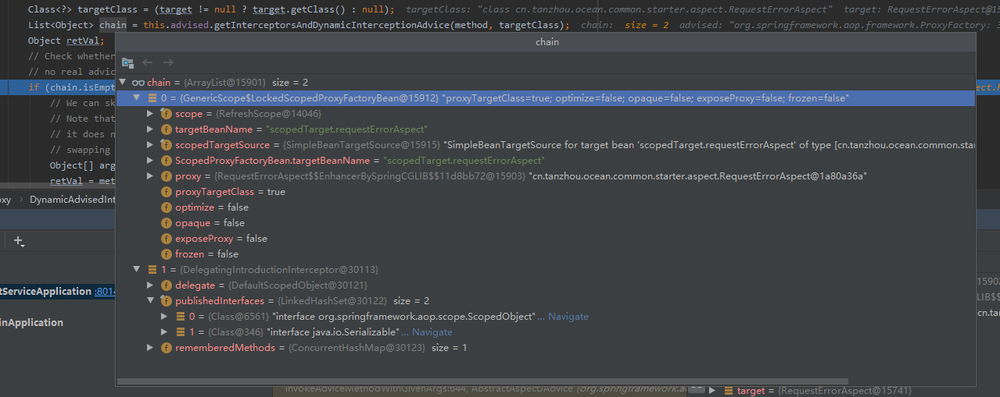

1. 首次调用，会有以下拦截链路：

 - 而后进入 ReflectiveMethodInvocation 的proceed方法。
 - 进入第一个拦截器ExposeInvocationInterceptor 的invoke方法。
 - 回到 ReflectiveMethodInvocation 的proceed方法。
 - 进入 AspectJAroundAdvice 的invoke方法，最终会进入到 RequestErrorAspect 的 切面方法 handleControllerMethod 中。
 - 由于上一步是around方法，所以中途会到 MethodInvocationProceedingJoinPoint 的proceed方法
 - 也就是回到 ReflectiveMethodInvocation 的proceed方法。
 
 - 此时，又会进入CglibAopProxy 的 invoke方法，此时的chain有两个，分别为：
 
 - 进入 GenericScope 的 invoke方法。
 - 由于是Advisor，所以再一次进入了 RequestErrorAspect 的 handleControllerMethod 方法
 - 进入 ReflectiveMethodInvocation 的 proceed 方法
 - 进入 CacheAspect 的 useCache 方法