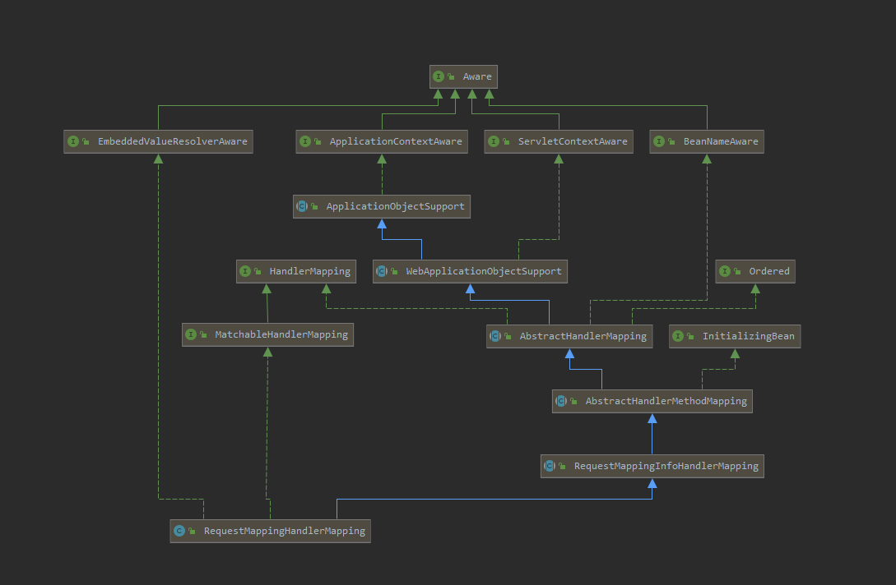

1. `http://localhost:8989/helloRest/index` 报404
2. `ControllerAdvice` 机制
3. 

结论：
1. RequestMappingHandlerMapping 负责解析controller等。

2. 在Spring 中，使用 `@CrossOrigin` 解决跨域问题：https://www.cnblogs.com/mmzs/p/9167743.html
3. Spring 中 FlashAttribute问题：https://www.oschina.net/translate/spring-mvc-flash-attribute-example
4. 使用 `http://localhost:8989/index/favicon.ico` 测试 AbstractUrlHandlerMapping
5. 404 时候，会调用doDispatch3次。（具体是2次+一个faco文件）

   普通能正常访问，会调用1